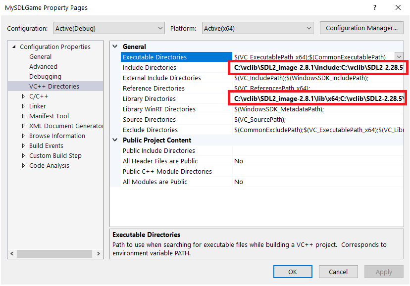
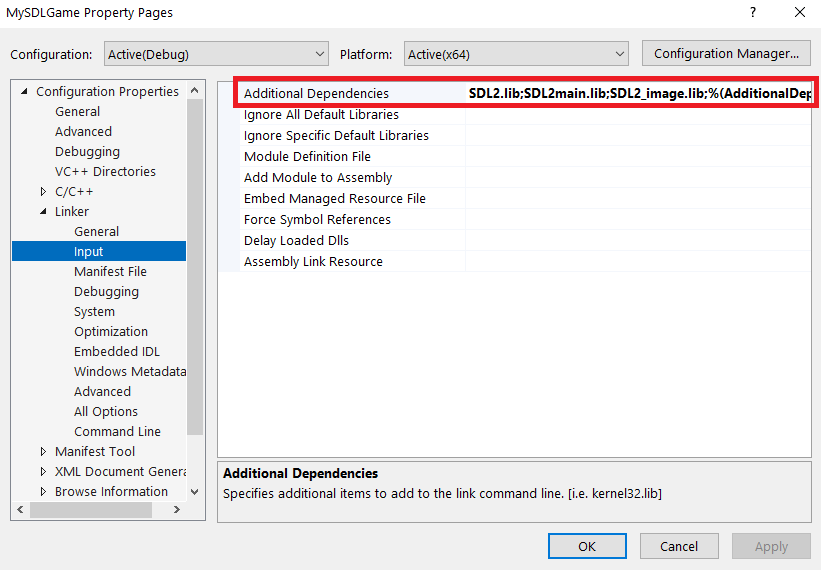

# Development
- Visual Studio 2022 is used for this project.
## Installing dependencies
1. Download the following libraries (VC version):
    - [SDL2](https://github.com/libsdl-org/SDL/releases)
    - [SDL_image](https://github.com/libsdl-org/SDL_image/releases/)
2. Extract the files and put them in a safe place.
3. Open VS project, press **Alt+F7**, click on **VC++ Directories**. Add your libraries path into indicated fields.
    
4. Find **Linker** > **Input**. Add your **\*.lib** files there.
    
5. Copy the SDL_image DLL file into your executable folder.